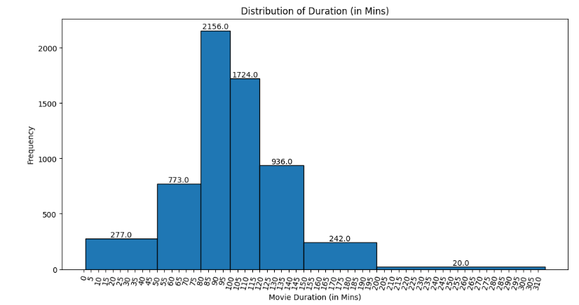
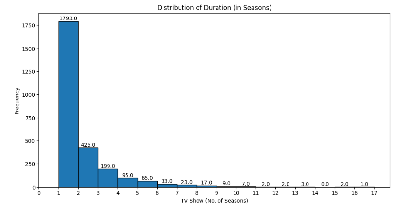
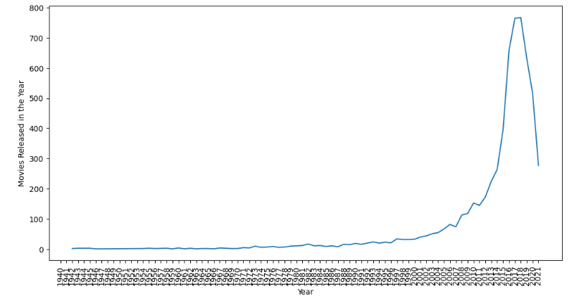
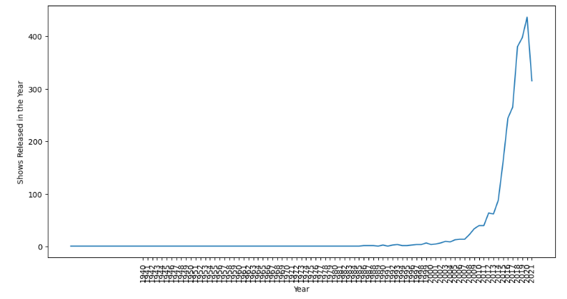
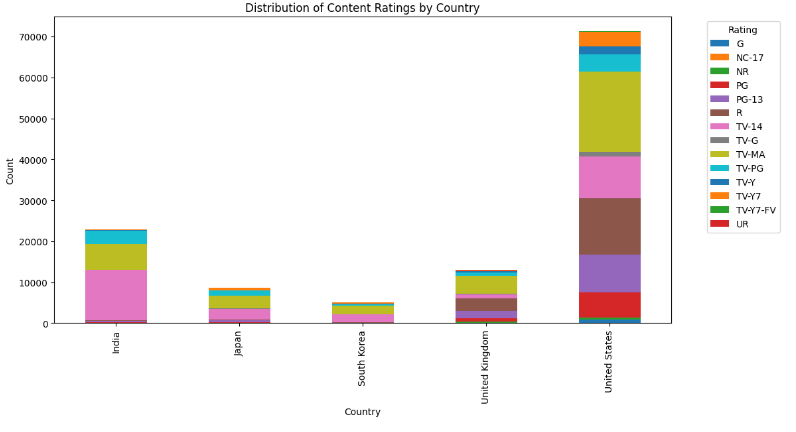
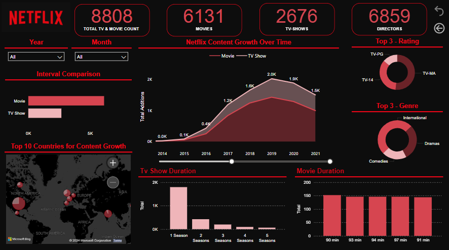

# NETFLIX Data Exploration and Visualization (POWER BI)

## Business Statement
- The aim of this case study is to determine which type of shows/movies to produce and how to grow the business for Netflix in different countries by analysing the dataset provided.
- To analyse the above metric we need to perform a proxy analysis on the count of movies/tv shows available for each genre which in return would tell the popularity of the same.

# Observations
## Duration

-  Movie duration between 80-120 minutes are very popular among the audience.

- TV Shows with number of seasons between 1-2 are the most common.

## Movie/Tv-Show Yearly Additions

- It can be observed that from 2019 afterwards the number of TV Shows and Movies added to Netflix have dropped drastically.
- Perhaps, this is part of a new business strategy to focus more on quality than quantity (e.g binge-worthy content). This could also be a result of recent financial struggles - this would require further investigation.

## Content Ratings

- Many countries do not have the robust variety of ratings that exist in the US and the UK. In these countries, the ratings can be a little more focused.

# POWER BI - Dashboard

# Business Insights

- Content Preference: Netflix users prefer movies over TV shows, indicating a higher demand for movies on the platform. This insight can guide content production and acquisition strategies to prioritize movie content.
- Popular Genres: International movies and dramas, as well as comedy titles, are highly popular among the audience. Investing in content production or licensing in these genres can attract and engage a larger user base.
- Genre Popularity: International TV shows, dramas, and TV comedies are found to be popular among the audience. Emphasizing these genres in content selection and production can enhance user engagement and satisfaction.
- Content Ratings: The majority of the content available on Netflix is rated as TV-MA and TV-14. This indicates that the audience prefers content with mature themes or content suitable for viewers above 14 years old. Aligning content offerings with popular ratings can cater to user preferences.
- Country of Production: United States, India, and United Kingdom are the top countries where movies are produced, while United States, United Kingdom, Japan, South Korea, and Canada are the top countries for TV show production. Focusing on content from these countries can cater to regional preferences and diverse audience interests.¶
- Content Addition Trend: There is a noticeable drop in the number of movies added after 2019 and TV shows added after 2020. Analyzing the reasons behind this trend and adjusting content acquisition or production strategies accordingly can help maintain a diverse and up-to-date content library.
- Rating and Country: The popularity of specific ratings varies across different countries. Tailoring content offerings based on the preferences of each country can enhance user satisfaction and engagement.

# Recommendations

- Content Production: Increase the production of movies to meet the high demand from users. Focus on producing international movies and dramas, as well as comedy titles, as these genres are popular among the audience. Collaborate with popular directors like Rajiv, Jan, Raúl, Suhas, and Marcus to create engaging and captivating content.
- Genre Selection: When acquiring content, prioritize international TV shows, dramas, and TV comedies, as these genres have shown high popularity among viewers. This can help attract and retain a larger audience base.
- Content Ratings: Continue to offer a wide range of content rated as TV-MA and TV-14, as these are the most popular ratings among viewers. However, ensure a diverse selection of content across various ratings to cater to different audience preferences.
- Regional Content Focus: Emphasize content from the United States, India, United Kingdom, Japan, South Korea, and Canada, as these countries have been identified as top producers of popular content. Invest in regional content production and acquisition strategies to cater to the specific preferences of each country.¶
- Investigate the reasons behind the drop in the number of movies added after 2019 and TV shows added after 2020.
